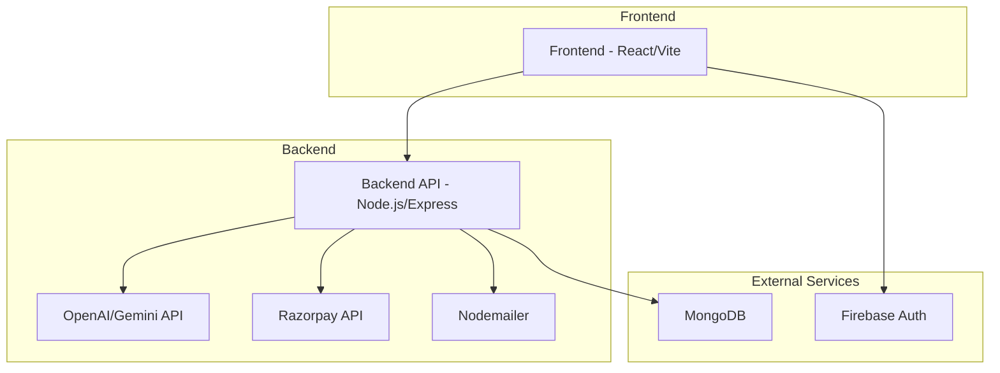

# LexEase Application Architecture

## Component Overview

### Frontend (React/Vite)
- **Framework**: React 18 with Vite build tool
- **Styling**: TailwindCSS
- **Routing**: React Router
- **Authentication**: Firebase Authentication
- **State Management**: React Context API
- **HTTP Client**: Axios

### Backend (Node.js/Express)
- **Framework**: Node.js with Express
- **Database**: MongoDB with Mongoose ODM
- **AI Services**: OpenAI API or Google Gemini API
- **Payments**: Razorpay SDK
- **Email**: Nodemailer
- **Authentication**: Firebase Admin SDK for token verification

### External Services
- **Firebase**: Authentication service
- **MongoDB**: Primary database
- **OpenAI/Gemini**: AI processing for chat and document generation
- **Razorpay**: Payment processing
- **Nodemailer**: Email delivery for contact forms and lawyer leads

## Data Flow

1. **User Authentication**: Users sign in with Google via Firebase Auth
2. **Document Creation**: 
   - User interacts with AI advisor through chat interface
   - Backend processes chat with OpenAI/Gemini API
   - Based on conversation, documents are generated using templates
3. **Payment Processing**: 
   - User selects payment option
   - Backend creates order with Razorpay
   - Frontend handles payment with Razorpay checkout
   - Backend verifies payment with Razorpay
4. **Lawyer Connection**: 
   - User submits lawyer lead form
   - Backend sends email via Nodemailer to lawyer
5. **Data Storage**: 
   - User data, transactions, and documents stored in MongoDB

## Color Scheme Implementation

The application now implements the requested color scheme:
- **Deep Blues**: Used for primary backgrounds and text (`#0a192f`)
- **Soft Whites**: Used for backgrounds and text (`#f8f9fa`)
- **Gold Accents**: Used for buttons, highlights, and accents (`#f9e068` and variations)
- **Teal Accents**: Available as secondary accent color (`#5bd8d8` and variations)

## Animations and Interactions

- **Smooth scroll-based animations** on the homepage
- **Hover micro-interactions** on buttons and cards
- **Subtle motion effects** throughout the UI
- **Responsive grid-based layout** with generous whitespace
- **Floating AI button** available site-wide